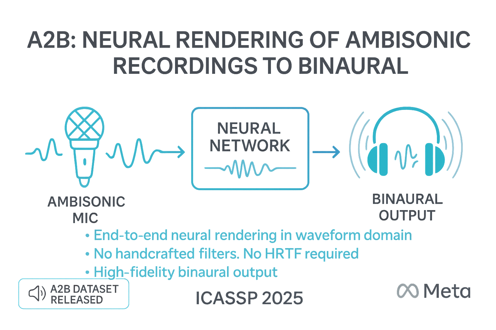

<a rel="license" href="http://creativecommons.org/licenses/by-nc/4.0/"></a> This work is licensed under a <a rel="license" href="http://creativecommons.org/licenses/by-nc/4.0/">Creative Commons Attribution-NonCommercial 4.0 International License</a>.
<p align="center">
    <!-- <h1 align="center">
        A2B: Neural Rendering of Ambisonic Recordings to Binaural
    </h1> -->

  <p align="center">
    
  </p>
  <p align="center">
      <strong>ICASSP 2025</strong>
      <br /> 
  </p>
  <p align="center">
    <a href='https://idgebru.com/paper/ICASSP2025_Arxiv____A2B.pdf' style='padding-left: 0.5rem;'>
        
    </a>
    <a href='https://isrish.github.io/a2b/'>
        
    </a>
  </p>
</p>
<br /> 

Welcome to the official repository for our ICASSP2025 paper, "A2B: Ambisonic to Binaural Rendering using Neural Network."
Here you'll find the implementation code, pre-trained models, and links to the A2B dataset discussed in our paper.

# A2B Dataset
We are releasing over 33.5 hours of paired ambisonic-binaural recordings collected with a 10th, 4th and 2nd order ambisonic microphones. We provide the microphone array geometries, which are required for DSP-based baselines such as MagLS used in our paper. 

### Dataset Variants and Sizes

- 10-A2B-R1: 635 GB (10.11 Hours)
- 10-A2B-R2: 648 GB (10.32 Hours)
- 4-A2B-MP: 72 GB (6.53 Hours)
- 2-A2B-MP: 32 GB (6.53 Hours)


## Download A2B Dataset
The [A2B Dataset](https://fb-baas-f32eacb9-8abb-11eb-b2b8-4857dd089e15.s3.amazonaws.com/A2B/index.html) is hosted on AWS S3.
We recommend using the AWS command line interface (see [AWS CLI installation instructions](https://docs.aws.amazon.com/cli/latest/userguide/getting-started-install.html)).
No AWS credentials are needed.

To download the dataset run:
```
aws s3 cp --recursive --no-sign-request s3://fb-baas-f32eacb9-8abb-11eb-b2b8-4857dd089e15/A2B/ A2B/
```
or use `sync` to avoid transferring existing files:
```
aws s3 sync --no-sign-request s3://fb-baas-f32eacb9-8abb-11eb-b2b8-4857dd089e15/A2B/ A2B/
```

To download a specific section of the dataset. For example "2-A2B-MP"
```
aws s3 cp --recursive --no-sign-request s3://fb-baas-f32eacb9-8abb-11eb-b2b8-4857dd089e15/A2B/A2B_Datasets/2-A2B-MP A2B/
```

## Public datasets
We benchmarked our method on publicly available ambisonic-to-binaural datasets. Scripts to download each dataset are provided below:

For Urbansounds
``` SHELL
$ sh src/preprocessing/urbansounds/download.sh
```

For BTPAB
``` SHELL
$ sh src/preprocessing/bytedance/download.sh
```

# Compose a dataset for model training
This script enables you to combine multiple recordings into a unified dataset suitable for training and validation. Example configuration can be found in "configs/data/debug.yaml".

Here is an example that uses the <a href="src/config/data/debug.yaml">debug.yaml</a> configuration. This step generates JSON configuration files that will be read by a pytorch dataset loader.

``` SHELL
$ python ./tools/prepare_dataset.py config_name="n2s_mk128_binaural" out_dir="exported_speakeasy_datasets/debug/"
```


# Model Training
Specify a configuration file via the config_name parameter.

## BTPAB
```shell
$ config_name="a2b_model_bytedance_v10_1"
python ./tools/train.py config_name="models/${config_name}"
```
## Urbansounds
```shell
$ config_name="a2b_model_urbansounds_v2"
python ./tools/train.py config_name="models/${config_name}"
```

## A2B R1
```shell
$ config_name="a2b_model_n2s_mk128_v1"
python ./tools/train.py config_name="models/${config_name}"
```

## A2B R2
```shell
$ config_name="a2b_model_hearsay_mk128_v1.yaml"
python ./tools/train.py config_name="models/${config_name}"
```

# Inference and Evaluations
```shell
config_name="n2s_mk128"
python inference/evaluations.py config_name=$config_name ckpt_path="pretrained_models/a2b_n2s/checkpoints/last.ckpt"
```

# Support for Ambisonic Rotation
TODO


# Citation
```
@inproceedings{gebru2025a2b,
  title={A2B: Neural Rendering of Ambisonic Recordings to Binaural},
  author={Gebru, Israel D and Keebler, Todd and Sandakly, Jake and Krenn, Steven and Markovi{\'c}, Dejan and Buffalini, Julia and Hassel, Samuel and Richard, Alexander},
  booktitle={ICASSP 2025-2025 IEEE International Conference on Acoustics, Speech and Signal Processing (ICASSP)},
  pages={1--5},
  year={2025},
  organization={IEEE}
}
```
        